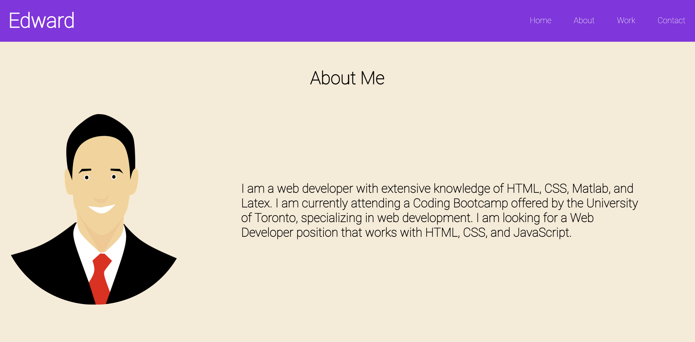
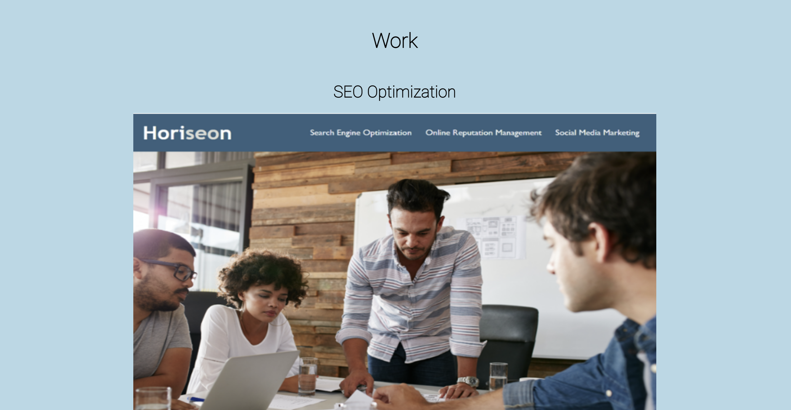
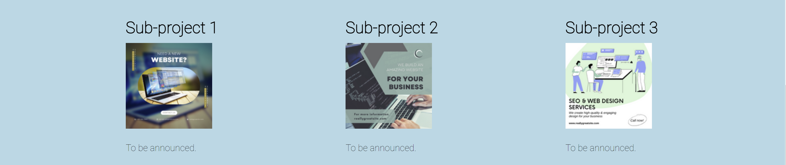
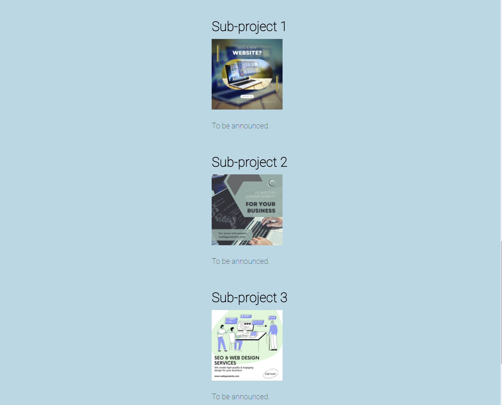
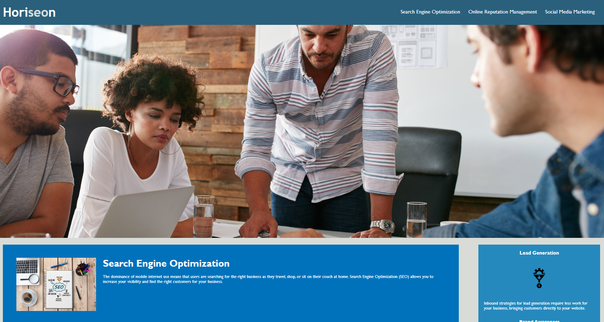

# Edward's Professional Profile

## Description

This project is aimed to establish a preofessional profile page for Edward, who is currently a Coding Bootcamp student at the University of Toronto and is looking for positions that will use the skills learned during the Bootcamp. This work will be viewed by potential employer for screening candidates.

## Work Performed

### <ins>Profile outline</ins>

The profile page includes a header which comprises of a logo and a navigation bar, a body that has about, work, and contact sections. 

### <ins>Responsive navigation bar</ins>

When the visitor clicks on the section on the navigation bar, the UI scrolls to the corresponding section.

* **Before clicking on "Work" section in the navigation**

* **After the click**

### <ins>Device-responsive feature</ins>

MediaQuerry and flexbox were used to establish device-responsiveness. The About section content, sub-project pictures, and Contact section content will change to a single column after minimizing the screen to 1200px. 

* **Screen dimension is larger than 1200px**

* **Screen dimension is smaller than 1200px**

### <ins> Pictures are linked directly to deployed work</ins>

All project pictures are linked directly to the website that showed the work.

* **The main project picture (before click)**

* **Deployed work website (afer click)**

## Link to Work

[GitHub](https://github.com/xzhw39/edward-xu-venus)

[Deployed Website](https://xzhw39.github.io/edward-xu-venus/)

